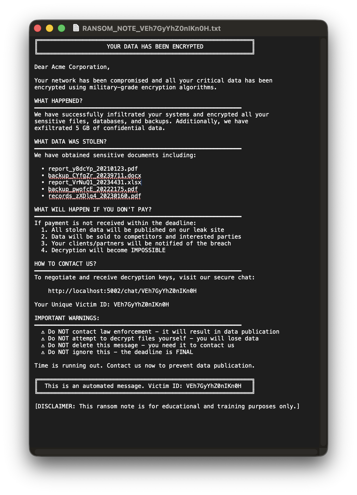

# RansomSim - Ransomware Data Leak Site Simulator

A Python3 web application for creating simulated ransomware data leak site posts. This educational tool allows you to generate realistic fake posts with language-specific document names and files.

## Screenshots

### Public Leak Site

*Main page displaying all published victims with sector badges and ransom amounts*

### Victim Chat Interface

*Victim chat login page where victims enter their unique ID*


*Real-time chat interface for victims to negotiate with the ransomware gang*

### Admin Panel

*Secure admin dashboard for managing victims and viewing statistics*


*Generate new victim entries with customizable details, sectors, and ransom amounts*

### Admin Chat Management

*Overview of all active victim conversations*


*Admin interface for responding to victim messages*

### Ransom Note Generation

*Generated ransom note with victim details and contact information*

## Features

- **Multi-language Support**: English (UK), French (FR), and German (DE)
- **Logo Upload**: Upload organization logos/icons (PNG, JPG, GIF, SVG)
- **Document Generation**: Generate fake document names based on language
  - English: National Insurance Numbers, Passports, Tax Returns, Salary Records, Restructuring Plans, etc.
  - French: Numéros de Sécurité Sociale, Cartes Nationales, Augmentations Salaires, Plans de Restructuration, etc.
  - German: Personalausweise, Steuererklärungen, Gehaltserhöhungen, Reorganisationspläne, etc.
- **File Generation**: Random file names with language-based prefixes
  - Formats: .xlsx, .docx, .pdf
  - Realistic naming conventions per language
- **Credential Files**: 3 random password/credential files automatically added to each post display
- **Sector Management**: Assign victims to industry sectors with FontAwesome icons:
  - Healthcare, Finance, Manufacturing, Retail, Technology, Education, Government, Energy, Telecommunications, Transportation
- **Ransom Amount**: Set custom ransom demands for each victim in USD
- **Countdown Timer**: Set deadline dates with real-time countdown display
- **Admin Dashboard**: Secure admin authentication with password protection
  - Create, Edit, Delete victims
  - Chat management interface
- **Chat System**: Bi-directional messaging between victims and ransomware gang
  - Victim-side chat interface with unique victim ID access
  - Admin-side chat dashboard
  - Real-time message polling
  - Message persistence in separate database
- **Auto-Responder**: Intelligent negotiation playbooks with state-machine responses
  - Keyword-based response triggers (proof, payment, deadline, threats, etc.)
  - Configurable per-victim enable/disable
  - Realistic gang negotiation dialogue
  - Customizable reply delay (2-10 seconds by default)
- **Fake News/Media Coverage**: Realistic simulated news articles about breaches
  - Auto-generated news articles with industry-specific impact assessments
  - **Multi-language support**: Articles generated in English, French, and German
  - Multiple fake news publications and journalist bylines per language
  - Expert quotes and threat analysis localized by language
  - Professional standalone news page design (no site navigation)
  - Accessible via `/_news/<victim_id>` route
  - Clickable links in victim chat interface (open in new tab)
  - Admin quick-insert button for news links in chat
- **Random IDs**: 16-character alphanumeric unique identifiers
- **Database Storage**: SQLite database for post and message persistence
- **Responsive Design**: Bootstrap 5 with FontAwesome icons
- **CRUD Operations**: Create, read, update, and delete posts

## Project Structure

```
RansomSim/
├── app.py                 # Main Flask application
├── libnews.py             # News article generation module
├── libscreenshots.py      # Proof of breach screenshot generators
├── requirements.txt       # Python dependencies
├── .env                   # Environment configuration (PORT, ADMIN_PASSWORD)
├── ransomsim.db          # SQLite database for victims (auto-created)
├── ransomsim-chat.db     # SQLite database for chat messages (auto-created)
├── templates/            # HTML templates
│   ├── base.html         # Base template with navbar
│   ├── index.html        # Home page - list all victims
│   ├── generate.html     # Generate new victim form
│   ├── edit.html         # Edit victim form
│   ├── post.html         # View specific victim details
│   ├── login.html        # Admin login page
│   ├── admin.html        # Admin dashboard
│   ├── admin_chat.html   # Admin chat management
│   ├── admin_chat_detail.html  # Admin chat conversation
│   ├── chat_login.html   # Victim chat login page
│   ├── chat.html         # Victim chat interface
│   ├── news.html         # Fake news article page
│   └── 404.html          # 404 error page
├── static/               # Static assets
│   ├── css/
│   │   └── style.css     # Custom CSS styling
│   └── js/
│       └── main.js       # JavaScript utilities
├── scripts/              # Utility scripts
│   └── seed.py           # Bulk victim data seeder
└── uploads/              # Uploaded logo images
```

## Installation

### Prerequisites
- Python 3.7+
- pip (Python package manager)

### Setup Steps

1. **Clone or navigate to the project directory:**
   ```bash
   cd RansomSim
   ```

2. **Create a virtual environment (optional but recommended):**
   ```bash
   python3 -m venv venv
   source venv/bin/activate  # On Windows: venv\Scripts\activate
   ```

3. **Install dependencies:**
   ```bash
   pip install -r requirements.txt
   ```

4. **Configure the application (optional):**
   Edit the `.env` file to customize settings:
   ```bash
   # Default: PORT=5002, ADMIN_PASSWORD=admin123
   nano .env
   ```
   Required environment variables:
   ```env
   PORT=5002
   ADMIN_PASSWORD=admin123
   SECRET_KEY=your-secret-key-here
   ```

5. **Run the application:**
   ```bash
   python3 app.py
   ```

6. **Access the application:**
   Open your browser and navigate to `http://localhost:5002` (or custom port from .env)

### Seed Example Data (optional)
Use the bulk seeder to quickly create realistic victims for demos and testing.

1. Seed default 10 victims:
   ```bash
   python ./scripts/seed.py
   ```
2. Seed a custom number (e.g., 25 victims):
   ```bash
   python ./scripts/seed.py -n 25
   ```
Notes:
- The seeder uses Faker to generate names, descriptions, sectors, languages, ransom amounts, deadlines, and document/file names.
- It writes directly to `ransomsim.db` and does not upload logos.
- You can run it multiple times to add more victims.

### Admin Access
- Admin login page: `http://localhost:5002/login`
- Default password: `admin123` (configured in `.env`)
- Admin dashboard: `http://localhost:5002/admin` (requires login)

## Usage

### Home Page
- View all victims
- See quick preview with sector badge and ransom amount
- View countdown timers for deadline dates
- Access victim details

### Admin Dashboard (requires login)
1. Navigate to `http://localhost:5002/login`
2. Enter admin password (default: `admin123`)
3. Access admin dashboard to:
   - Create new victims
   - Edit existing victims
   - Delete victims
   - Manage chat conversations
   - View victim details with edit/delete options

### Create/Edit Victim
When creating or editing a victim, fill in:
   - **Name**: Organization name
   - **Language**: Select UK, FR, or DE
   - **Logo** (optional): Upload an image file (PNG, JPG, GIF, SVG)
   - **Business Sector**: Select from 10 industry sectors (Healthcare, Finance, Manufacturing, Retail, Technology, Education, Government, Energy, Telecommunications, Transportation)
   - **Ransom Amount**: USD amount demanded (e.g., 500000)
   - **Number of Documents**: 1-15 documents to generate
   - **Description**: Leak message or description
   - **Deadline**: Set countdown timer date/time (optional)
   - **Enable Auto-Responder**: Toggle to enable/disable automatic gang replies for this victim

Generated content:
   - 3 random credential/password files automatically added
   - Realistic document names based on language
   - Random .xlsx, .docx, .pdf file names
   - Each victim gets a unique 16-character ID
   - Data stored in SQLite database

### View Victim Details
- Click "View Details" to see full victim information
- View all generated documents and files with icons:
  - Green folder icon for .xlsx files
  - Blue folder icon for .docx files
  - Red folder icon for .pdf files
- See sector with FontAwesome icon and badge
- See ransom amount with dollar sign formatting
- View organization logo if uploaded
- Access chat contact URL for victim communication

### Chat System
- **Victim Access**: Go to `/chat` and enter victim ID to access victim-side chat
- **Admin Access**: Go to `/admin/chat` to view all conversations and send messages
- Real-time message polling updates every 3 seconds
- Message history persisted in separate database
- Delete chat conversations from admin interface

### Auto-Responder (Negotiation Playbooks)
When enabled, the gang automatically replies to victim messages based on negotiation keywords and context:

**Keyword Triggers:**
- **Proof/Sample**: Requests for decryption proof trigger sample recovery instructions
- **Payment/Crypto**: Mentions of Bitcoin, Monero, or payment methods get crypto payment options
- **Negotiation**: Price discussions, discounts, or offer attempts receive negotiation terms
- **Deadline**: Extension or delay requests get extension cost details
- **Law Enforcement**: Threats involving police/authorities receive stern warnings
- **Contact**: Questions about communication channels get strict contact protocol
- **Recovery**: Mentions of backups or recovery tools get dismissal responses
- **Publish/Leak**: Data publication threats get escalation warnings
- **Threat**: Confrontational messages receive hardened responses

**Configuration:**
- Enable/disable per victim in the Create/Edit form
- Customize reply delay in `.env`:
  ```env
  CHAT_REPLY_DELAY_MIN=2
  CHAT_REPLY_DELAY_MAX=10
  ```
- Default delay: 2-10 seconds (randomized per message)

**Behavior:**
- Auto-responder generates replies in background thread
- Victim sees realistic gang responses without admin intervention
- Admin can override with manual messages anytime
- All auto-responses stored in chat history

### Proof of Breach Gallery
Displays realistic simulated screenshots of exfiltrated data to prove the gang has actual breach evidence:

**Features:**
- Three auto-generated realistic screenshot types in SVG format:
  1. **HR Database Export** - Terminal-style CSV showing employee PII (names, emails, IDs, salaries)
  2. **Confidential Legal Documents** - NDA document with M&A discussions and sensitive information
  3. **Executive Emails** - Microsoft Outlook inbox with confidential business communications
- **Country-specific realism**:
  - Employee names from realistic pools per country (UK, FR, DE)
  - Local email domains (yahoo.co.uk, free.fr, web.de, etc.)
  - Country-specific ID formats:
    - UK: National Insurance Numbers (AB123456C)
    - FR: INSEE numbers (13-digit format)
    - DE: Personalausweisnummer (10-digit format)
  - Correct currency symbols (£ for UK, € for FR/DE)
- **Dynamic email content**:
  - Pool of 20+ confidential subject lines per language
  - Randomly selects and displays 10 emails per screenshot
  - Emails sorted by recency: today (by time) → yesterday → older emails
  - Realistic timestamps and unread indicators
  - Language-localized sender titles and departments
- **Multi-language support**: All titles, descriptions, and content in UK English, French, or German
- **Gallery cards** in victim detail page showing:
  - Visual preview of each screenshot
  - Description of leaked data type
  - Badge indicating proof type (Proof sample, Redacted view, Sensitive)

**Accessed Via:**
- `/post/<victim_id>` - "Proof of Breach" gallery appears above media coverage section
- Screenshots auto-generate dynamically each page load with different data

**Sample Screenshots Include:**
- HR Data Leak: Names like "Oliver Thompson" (UK), "Pierre Dubois" (FR), "Lukas Müller" (DE)
- Legal Document: Realistic NDA with confidential M&A information, dates, classified content
- Executive Emails: Topics like "Q4 Restructuring Plan", "Employee Termination List", "M&A Target Analysis"

### Fake News/Media Coverage
Adds immersive realism to the simulation by generating realistic news articles about breaches:

**Features:**
- Dynamically generated news articles based on victim data
- **Multi-language support**: English (UK), French (FR), German (DE)
- Multiple fake news publications per language:
  - English: TechNews Daily, CyberSecure Weekly, Data Breach Report, etc.
  - French: TechNews Quotidien, Cybersécurité Hebdo, etc.
  - German: TechNews Täglich, Cybersicherheit Wöchentlich, etc.
- Realistic journalist bylines and dates in each language
- Industry-specific impact assessments translated for each language
- Expert quotes from fake cybersecurity analysts in victim's language
- Sector-specific threat details and regulatory implications
- Professional standalone news page design with:
  - Gradient backgrounds and modern typography
  - FontAwesome icons throughout
  - Animated elements and hover effects
  - Responsive mobile-first layout
  - No site navigation (clean news portal experience)
- Related articles section in appropriate language
- Clickable URLs in chat messages (auto-detected and linked)

**Accessed Via:**
- `/post/<victim_id>` - Three news link cards appear in "Media Coverage" section
- `/_news/<victim_id>` - Direct access to full article (auto-detects victim's language)
- Admin chat: "Insert News Article Link" button to quickly add link to messages
- Victim chat: URLs automatically become clickable links with `target="_blank"`

**Impact Details by Sector:**
- Healthcare: HIPAA violations, patient privacy concerns
- Finance: SEC investigations, investor losses
- Manufacturing: Supply chain disruption
- Retail: PCI DSS violations, credit card fraud
- Technology: IP theft, competitive disadvantage
- Education: FERPA violations, student records
- Government: National security implications
- Energy: Critical infrastructure exposure
- Telecommunications: Network security weaknesses
- Transportation: Logistics and safety concerns

## API Endpoints

### Public Routes
- `GET /` - Home page, list all victims
- `GET /post/<post_id>` - View specific victim details
- `GET /chat` - Chat login page
- `POST /chat` - Submit victim ID to access chat
- `GET /chat/<victim_id>` - Victim chat interface
- `GET /chat/<victim_id>/messages` - Get messages (AJAX)
- `POST /chat/<victim_id>/send` - Send message (AJAX)

### Admin Routes (requires authentication)
- `GET /login` - Admin login form
- `POST /login` - Authenticate admin
- `GET /logout` - Logout admin
- `GET /admin` - Admin dashboard
- `GET /generate` - Create victim form
- `POST /generate` - Create new victim
- `GET /edit/<post_id>` - Edit victim form
- `POST /edit/<post_id>` - Update victim
- `POST /delete/<post_id>` - Delete victim
- `GET /admin/chat` - Chat management dashboard
- `GET /admin/chat/<victim_id>` - Admin chat with specific victim
- `POST /admin/chat/<victim_id>/send` - Admin send message
- `POST /admin/chat/<victim_id>/delete` - Delete chat conversation
- `GET /_news/<victim_id>` - View fake news article about victim breach

## Database Schema

### Table: posts (ransomsim.db)
- `id` (TEXT, PRIMARY KEY): 16-character unique identifier
- `name` (TEXT): Organization name
- `logo_path` (TEXT): Path to uploaded logo image
- `description` (TEXT): Leak description/message
- `language` (TEXT): Language code (UK, FR, DE)
- `document_names` (TEXT): Comma-separated list of document names
- `file_names` (TEXT): Comma-separated list of file names
- `sector` (TEXT): Business sector (healthcare, finance, manufacturing, etc.)
- `ransom_amount` (TEXT): USD ransom demand
- `deadline_date` (TEXT): Deadline date/time for countdown timer
- `created_at` (TIMESTAMP): Creation timestamp

### Table: messages (ransomsim-chat.db)
- `id` (INTEGER, PRIMARY KEY, AUTOINCREMENT): Message ID
- `victim_id` (TEXT): Unique victim/post ID
- `sender` (TEXT): Message sender ('victim' or 'gang')
- `message` (TEXT): Message content
- `created_at` (TIMESTAMP): Message timestamp

## Document Types Generated

### English (UK)
Personal Documents:
- National Insurance Numbers
- Driving Licences
- Passport Scans
- Tax Returns
- Bank Statements
- Utility Bills
- Employment Contracts
- Medical Records
- Insurance Policies
- Property Deeds

Business Documents:
- Salary Increase Records
- Redundancy Plans
- Restructuring Strategies
- Board Minutes
- Strategic Plans
- Merger & Acquisition Details
- Financial Forecasts
- Executive Compensation Records
- Layoff Lists
- Confidential Agreements

Credential Files:
- Admin Passwords
- Database Credentials
- FTP Logins
- Email Passwords
- VPN Configurations
- Root Access
- System Passwords

### French (FR)
Personal Documents:
- Numéros de Sécurité Sociale
- Cartes Nationales
- Passeports
- Déclarations d'Impôts
- Relevés Bancaires
- Factures EDF
- Contrats de Travail
- Dossiers Médicaux
- Attestations d'Assurance
- Actes de Propriété

Business Documents:
- Augmentations Salaires
- Réductions Effectifs
- Plans de Restructuration
- Procès-Verbaux de Réunion
- Stratégies d'Entreprise
- Détails Fusion Acquisition
- Prévisions Financières
- Salaires des Cadres
- Listes de Licenciements
- Accords de Confidentialité

Credential Files:
- Mots de Passe Admin
- Identifiants
- Clés d'Accès
- Connexion FTP
- Emails
- Configuration VPN
- Accès Root
- Mots de Passe Système

### German (DE)
Personal Documents:
- Personalausweise
- Reisepässe
- Steuererklärungen
- Kontoauszüge
- Stromrechnungen
- Arbeitsverträge
- Krankenakten
- Versicherungspolicen
- Grundbuchauszüge
- Rentenbescheide

Business Documents:
- Gehaltserhöhungen
- Abbaupläne
- Reorganisationsstrategien
- Sitzungsprotokolle
- Unternehmensplan
- Fusionsdetails
- Finanzprognosen
- Geschäftsführervergütung
- Kündigungslisten
- Geheimhaltungsvereinbarungen

Credential Files:
- Passwort Admin
- Anmeldedaten
- Zugriffsschlüssel
- Datenbankpasswörter
- FTP-Login
- Email-Passwörter
- VPN-Konfiguration
- Root-Zugang
- Systempasswörter

### Sector Types with Icons
- Healthcare ⚕️ (fa-hospital)
- Finance 💰 (fa-money-bill)
- Manufacturing 🏭 (fa-industry)
- Retail 🛒 (fa-shopping-cart)
- Technology 💻 (fa-laptop)
- Education 🎓 (fa-graduation-cap)
- Government 🏛️ (fa-landmark)
- Energy ⚡ (fa-bolt)
- Telecommunications 📡 (fa-broadcast-tower)
- Transportation 🚚 (fa-truck)

## Technology Stack

- **Backend**: Flask 2.3.3 (Python web framework)
- **Database**: SQLite3 (dual databases: ransomsim.db for victims, ransomsim-chat.db for messages)
- **Frontend**: HTML5, CSS3, JavaScript (ES6+)
- **CSS Framework**: Bootstrap 5.3.0
- **Icons**: FontAwesome 6.4.0
- **File Handling**: Werkzeug (secure file uploads)
- **Environment**: Python 3.7+
- **Configuration**: python-dotenv 1.0.0

## Security Notes

This is an **educational tool** for cybersecurity training and simulation purposes only. It should:
- Only be used in controlled environments
- Not be deployed to public internet without proper security measures
- Not be used for malicious purposes
- Comply with all local laws and regulations

## Configuration

### Environment Variables (.env)

RansomSim uses a `.env` file for configuration. Key settings:

```env
# Web server port (default: 5002)
PORT=5002

# Admin dashboard password (default: admin123)
ADMIN_PASSWORD=admin123

# Flask secret key for session management
SECRET_KEY=your-secret-key-here

# Flask environment (development/production)
FLASK_ENV=development

# Flask debug mode (True/False)
FLASK_DEBUG=True

# Maximum file upload size in bytes (default: 16MB)
MAX_UPLOAD_SIZE=16777216
```

### Changing the Port

Edit `.env` and change the PORT value:
```env
PORT=8080
```

Then run the application:
```bash
python3 app.py
# Server will run on http://localhost:8080
```

### Changing Admin Password

Edit `.env` and update ADMIN_PASSWORD:
```env
ADMIN_PASSWORD=your-secure-password
```

### Default Configuration

If no `.env` file exists, the application uses these defaults:
- **PORT**: 5002
- **ADMIN_PASSWORD**: admin123
- **FLASK_DEBUG**: True
- **FLASK_ENV**: development
- **MAX_CONTENT_LENGTH**: 16MB

```python
# Upload folder path
app.config['UPLOAD_FOLDER'] = 'uploads'

# Generated files folder path
app.config['GENERATED_FOLDER'] = 'generated_files'

# Allowed file extensions for logos
ALLOWED_EXTENSIONS = {'png', 'jpg', 'jpeg', 'gif', 'svg'}
```

## Customization

### Add More Languages
Edit `generators.py` and add new language support:

```python
class DocumentNameGenerator:
    def __init__(self, language='UK'):
        # Add new language templates
        self.es_docs = [...]  # Spanish documents
```

### Modify Document Templates
Update the document name templates in `generators.py` to customize:
- Document types
- Naming patterns
- Available formats

### Styling
Customize the look and feel by editing `static/css/style.css`:
- Color scheme
- Typography
- Layout adjustments
- Responsive breakpoints

### Troubleshooting

### Port Already in Use
If port 5002 is in use, modify `.env`:
```env
PORT=8080
```

Then run the application:
```bash
python3 app.py
# Server will run on http://localhost:8080
```

### Database Issues
To reset the databases:
```bash
rm ransomsim.db ransomsim-chat.db
python3 app.py
```
This will recreate both databases with fresh schema on startup.

### File Upload Issues
Ensure the `uploads/` directory exists and is writable:
```bash
mkdir -p uploads
chmod 755 uploads
```

### Admin Login Issues
- Default password: `admin123`
- To change password, edit `.env` file and update `ADMIN_PASSWORD`
- The password is case-sensitive
- Clear browser cookies if login persists incorrectly

### Chat Not Working
- Ensure `ransomsim-chat.db` exists (auto-created on first message)
- Check browser console for JavaScript errors
- Verify victim ID is correct (16-character alphanumeric)
- Check that chat endpoint is accessible at `/chat/<victim_id>`

## License

MIT License

Educational use only. Use responsibly.

## Author

Julien Mousqueton

## Contributing

Suggestions and improvements welcome!
